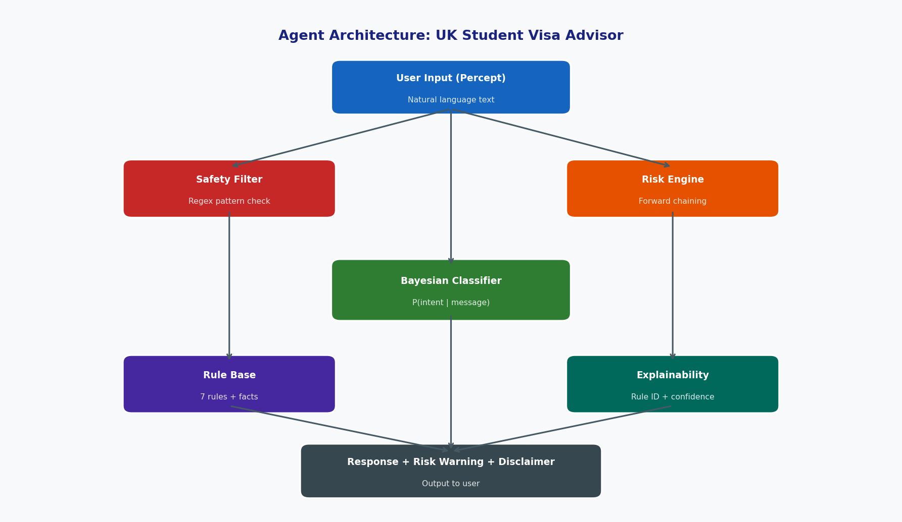
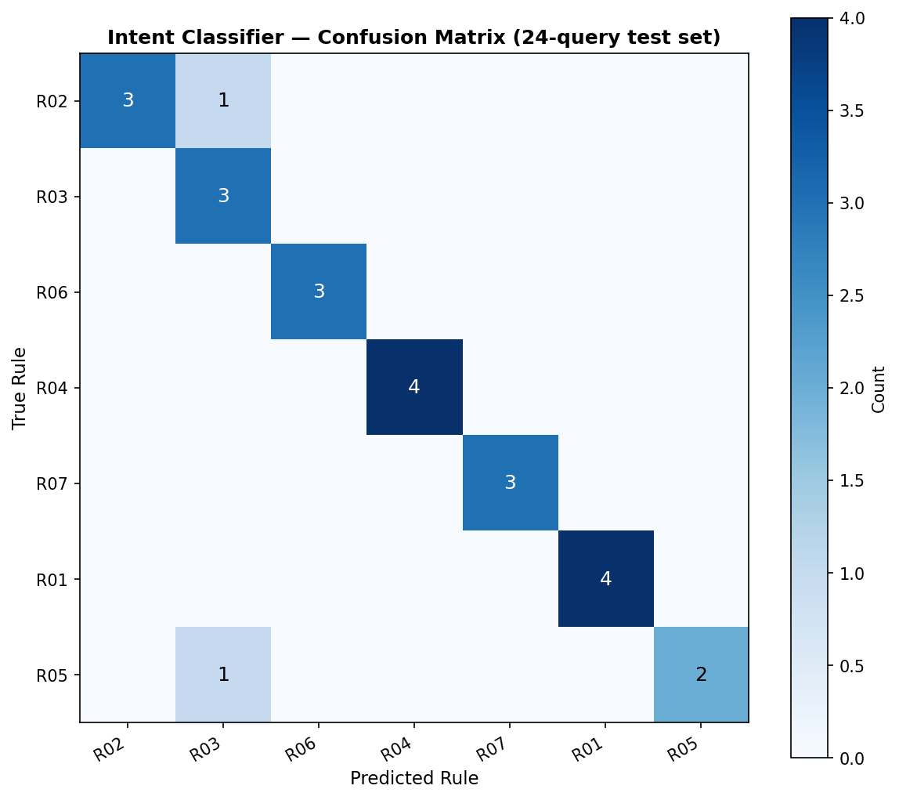
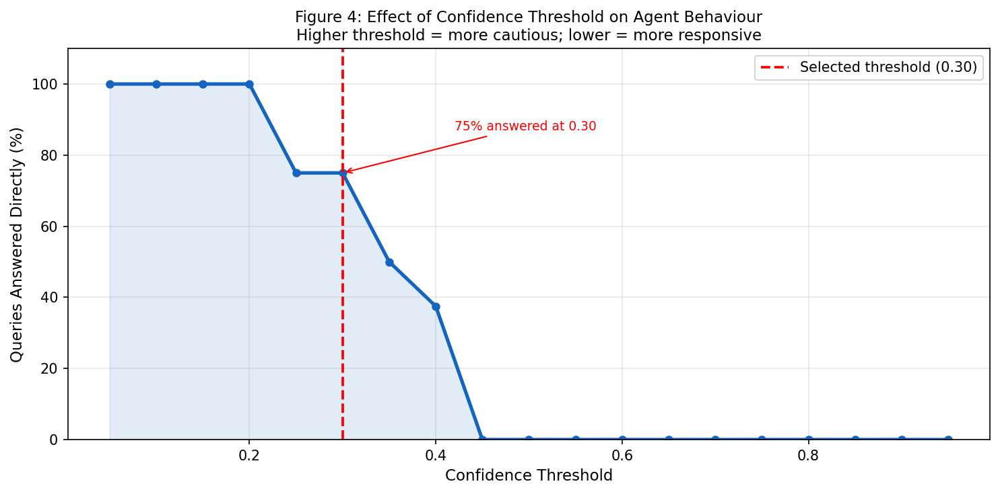
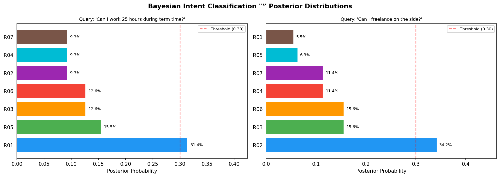
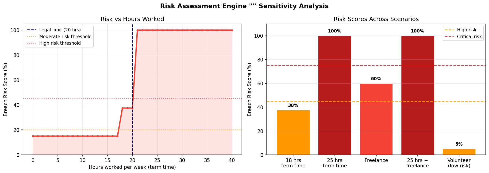

🎓 UK Student Visa and Work Rights Advisor

A rule-based conversational AI agent that gives international students in the UK immediate, traceable guidance on Student visa work conditions — combining a Bayesian intent classifier with a forward-chaining risk engine.

Module: CMP-N206-0 — Artificial Intelligence | BSc Computer Science
Author: Hajar Natiq | A00024033 | University of Roehampton

📋 Overview

International students face a complex legal landscape where misunderstanding work conditions can have severe consequences — including visa curtailment and a ten-year re-entry ban. This agent addresses that problem computationally, prioritising legal reliability and traceability over the unpredictable behaviour of generative language models.

Built on the PEAS framework (Russell & Norvig), the agent senses user text, processes it through structured legal logic, and returns signposted guidance or risk warnings — never a definitive legal ruling.

🧠 Agent Architecture

The agent runs a dual-layer inference pipeline on every query:

1. **Safety Filter** — regex-based check that refuses any attempt to evade visa conditions
2. **Bayesian Intent Classifier** — Naive Bayes with Laplace smoothing (α = 0.5) computes P(intent | message) across 7 rules
3. **Confidence Threshold** — below 0.22 posterior probability, the agent asks for clarification instead of guessing
4. **Forward-Chaining Risk Engine** — evaluates 6 weighted risk factors (hours worked, self-employment, multiple employers, etc.) from a 5% base prior
5. **Explainability Layer** — every response includes the fired rule ID, confidence score, and full ranked intent distribution

📚 Knowledge Representation

- **Fact database**: structured UKVI rules sourced from official GOV.UK and UKCISA guidance (20-hour term-time cap, self-employment prohibition, holiday exemptions)
- **Production rule base**: 7 IF-THEN rules, each with a keyword set, cited response, explanation string, and domain tag — fully traceable back to source

📊 Evaluation

| | |
|---|---|
|  |  |
| Intent classifier confusion matrix (24-query test set) | Effect of confidence threshold on agent responsiveness |

| | |
|---|---|
|  |  |
| Bayesian posterior distributions for sample queries | Risk score sensitivity across hours worked and scenarios |

**Success cases** include standard hours queries (98.2% confidence), confirmed breach detection (Critical risk, 100%), and self-employment queries (97.8% confidence).

**Known limitations**: informal slang isn't recognised without embedding-based similarity; the agent is stateless across turns; and it's scoped to Student visas only. See the full report for proposed improvements.

⚖️ Ethical Considerations

- **Non-maleficence by design**: a safety filter refuses any request seeking to evade visa conditions, regardless of framing
- **Uncertainty handling**: confidence thresholding, Laplace smoothing, and a continuous (not binary) risk score avoid false confidence
- **Sustainability**: a symbolic, rule-based approach avoids the computational and carbon cost of large generative models (Strubell et al., Schwartz et al.)
- **Transparency**: aligned with EU AI Act Article 13 requirements — every decision is traceable to a specific rule and source

Full write-up, references, and evaluation detail available in `report.pdf`.

🛠️ Tech Stack

Python · Naive Bayes (Laplace smoothing) · Forward-chaining rule engine · Matplotlib

---

*This project was built for CMP-N206-0 Artificial Intelligence coursework at the University of Roehampton.*
